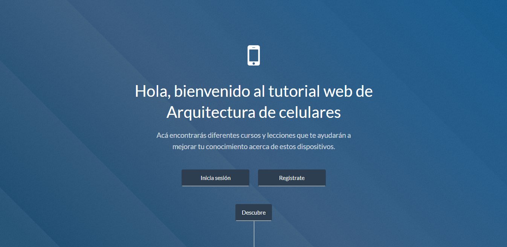
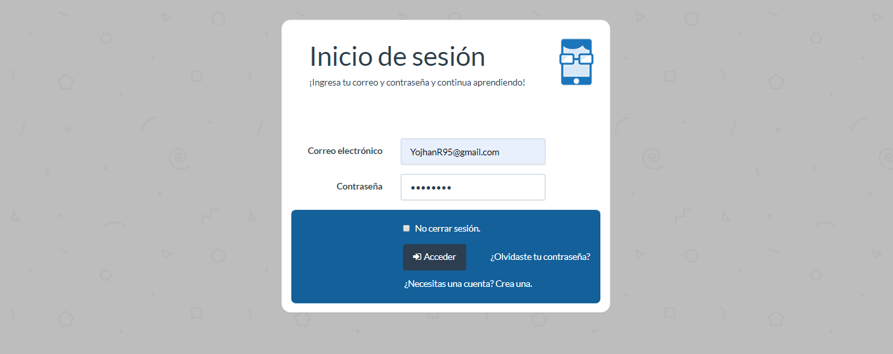
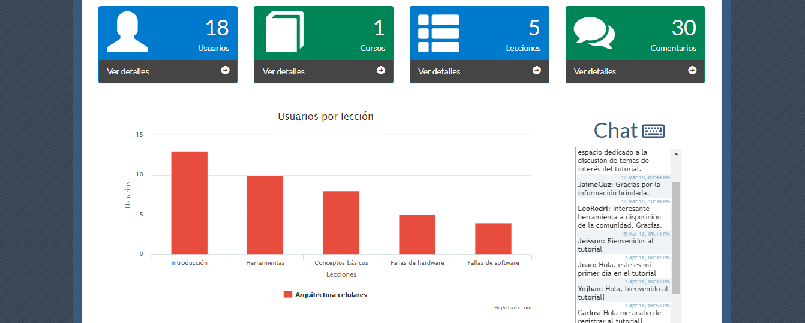
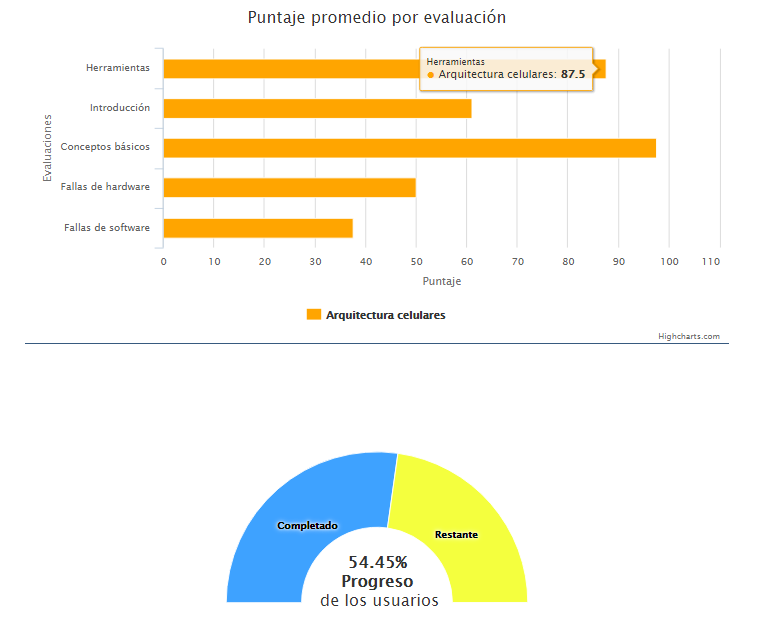
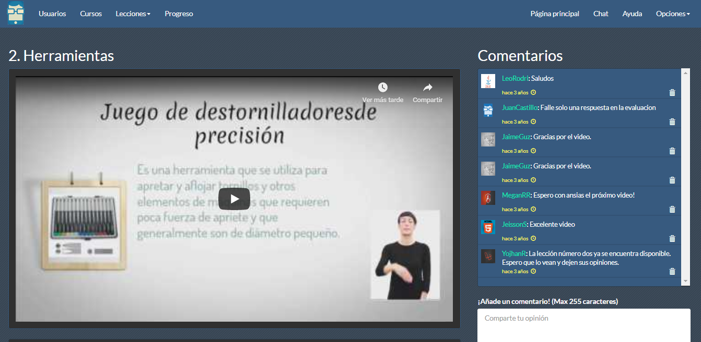
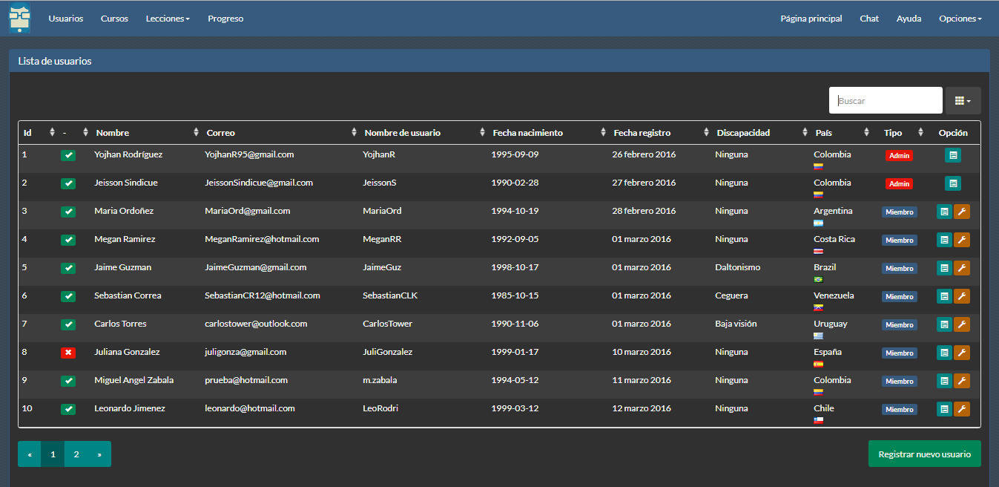
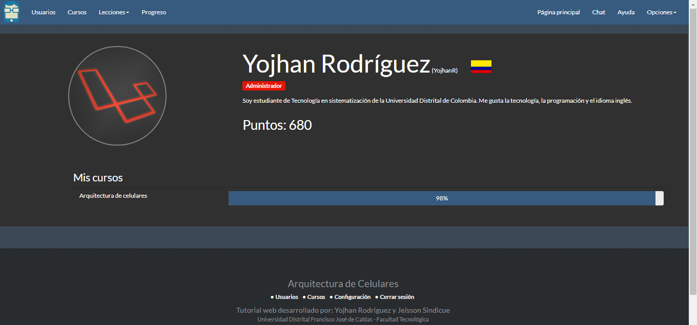

# Tutorial educativo accesible de arquitectura de celulares.

El presente proyecto es un aplicativo web que cumple con los estándares de accesibilidad propuestos por la W3C en las directrices de WCAG 2.0 el cual satisface el nivel A. El principal objetivo de esta página es ofrecer cursos virtuales acerca de la arquitectura de los celulares sin excluir a la población que sufra alguna discapacidad.  

## Screenshots
  
  
  
  
  
  
  

## Acerca de

Esta aplicación fue desarrollada por Yojhan Rodríguez y Jeisson Sindicue, estudiantes de la Universidad Distrital Francisco José de Caldas en Bogotá - Colombia.

## Configuraciones
Base de datos: Query para MySQL en la carpeta queries
Usuarios:   - Usuario admin: Yojhanr95@gmail.com
            - Se puede ver el correo fácilmente de todos los usuarios en el query mencionado.
            - Todos los usuarios tienen clave 12345678

